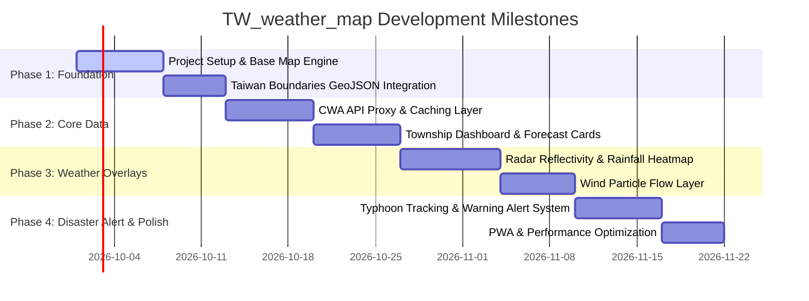

# Taiwan Weather Map (`TW_weather_map`) - System Design & Architectural Specification

## 1. Overview & System Purpose

**Taiwan Weather Map (`TW_weather_map`)** is an interactive, real-time web application designed to visualize microclimate weather data across Taiwan. Powered by the **Central Weather Administration (CWA - 交通部中央氣象署) Open Data APIs**, the platform delivers real-time weather observations, forecast visualizations, interactive spatial heatmaps, radar overlays, and disaster warnings.

### Key Goals
- **Interactive Geospatial Visualization**: Fluid map interaction with vector boundary highlighting down to Taiwan's county and township levels.
- **Real-Time Data Pipeline**: Low-latency fetching and caching of CWA weather station observations, radar reflectivity grids, and rain gauge data.
- **Comprehensive Weather Layers**: Multi-layer toggles for temperature, rainfall accumulation, wind velocity vectors, radar reflectivity, and typhoon path tracking.
- **Modern Glassmorphic UI**: High-aesthetic visual presentation with dynamic light/dark themes synchronized with regional sunrise and sunset times.

---

## 2. System Architecture & Topology

The system employs a client-first geospatial architecture paired with lightweight edge proxy functions for API caching, CORS handling, and data normalization.

```mermaid
flowchart TD
    subgraph External Systems
        CWA["Taiwan CWA Open Data API<br/>(opendata.cwa.gov.tw)"]
        OSM["Mapbox / OpenStreetMap Tiles"]
    end

    subgraph Edge / Proxy Layer
        Proxy["API Proxy & Cache Gateway<br/>(Edge Functions / Serverless)"]
        Cache[("Redis / Edge Cache<br/>(TTL: 5-15 mins)")]
    end

    subgraph Frontend Client (TW_weather_map)
        State["State Engine & Query Manager<br/>(TanStack Query / Zustand)"]
        GeoEngine["Geospatial Data Engine<br/>(Turf.js & GeoJSON Parser)"]
        MapCanvas["Interactive Map Canvas<br/>(Leaflet / Mapbox GL JS / WebGL)"]
        UI["UI Layer<br/>(Forecast Cards, Alerts Ticker, Layer Controls)"]
    end

    CWA -->|Raw Weather API Data| Proxy
    Proxy <--> Cache
    Proxy -->|Normalized GeoJSON & JSON| State
    OSM -->|Base Map Tiles| MapCanvas
    State --> GeoEngine
    GeoEngine --> MapCanvas
    State --> UI
    MapCanvas <--> UI
```

---

## 3. Technology Stack

| Layer | Technology / Library | Purpose |
| :--- | :--- | :--- |
| **Frontend Framework** | React 18+ / Vite (TypeScript) | Declarative UI, component lifecycle, type safety |
| **Geospatial Engine** | Leaflet.js / Mapbox GL JS / Deck.gl | Vector & raster tile rendering, custom canvas overlays |
| **Spatial Analysis** | Turf.js | Client-side spatial indexing, interpolation, spatial joins |
| **Data Fetching & Cache** | TanStack Query (React Query) | Data freshness, polling, optimistic caching, automatic retry |
| **State Management** | Zustand | Global application state (selected layer, selected township, active modal) |
| **Styling & UI System** | CSS Modules / Vanilla CSS | High-performance CSS design system with glassmorphism effects |
| **Data Visualization** | Recharts / Chart.js | 24-hour temperature & rainfall trend charts |
| **Data Source** | CWA Open Data API | Official Taiwan weather datasets |

---

## 4. Core Feature Specifications

### 4.1 Interactive Map Engine & Layers
- **Base Map Styles**: Dark vector canvas, satellite imagery, and light topographical maps.
- **Administrative Boundaries**: Smooth rendering of Taiwan's 22 counties/cities and 368 townships using simplified GeoJSON datasets.
- **Weather Layer Toggles**:
  1. **Radar Reflectivity (即時雷達回波)**: Time-series animated layer showing cloud/precipitation reflectivity.
  2. **Cumulative Rainfall (累積雨量熱力圖)**: Color-coded heatmaps for 1-hour, 3-hour, and 24-hour precipitation levels.
  3. **Temperature Distribution (即時氣溫圖)**: Isothermal contours and point-based weather station markers.
  4. **Wind Field Vectors (風場流向動畫)**: Canvas particle streams animating wind speed and vector directions.
  5. **Typhoon Path & Warning Overlay (颱風路徑與警戒區域)**: Real-time track prediction cone, historical locations, and sea/land warning zones.

### 4.2 City & Township Weather Dashboard
- **Location Auto-Detection**: Browser Geolocation API to auto-center and fetch local township weather.
- **Weather Metrics Overview**: Current temperature, feels-like temperature, humidity, UV index, air quality index (AQI), wind direction, and air pressure.
- **Hourly & Weekly Forecasts**: 24-hour forecast carousel and 7-day trend analysis cards.

### 4.3 Severe Weather & Emergency Alert System
- **Real-Time Warning Banner**: Visual indicators for:
  - Typhoon Alerts (陸上/海上颱風警報)
  - Heavy/Extremely Heavy Rain Warnings (豪大雨特報)
  - High Temperature Warnings (高溫資訊)
  - Strong Wind Warnings (陸上強風特報)
- **Interactive Warning Modal**: Details on affected regions, start/end timestamps, and precautionary recommendations.

---

## 5. API Integration & Data Schema

The platform integrates several primary CWA Open Data API endpoints:

### 5.1 Key API Endpoints

| Dataset Name | CWA Data ID | Update Freq | Application Usage |
| :--- | :--- | :--- | :--- |
| **General Weather Forecast (36h)** | `F-C0032-001` | 6 hours | County-level weather overview & icons |
| **Township 7-Day Forecast** | `F-D0047-091` | 12 hours | Township detail panels & temperature trends |
| **Auto Weather Station (AWS)** | `O-A0001-001` | 10 mins | Live station temperature, pressure, wind speed |
| **Rain Gauge Observation** | `O-A0058-001` | 10 mins | Real-time rainfall accumulation mapping |
| **Radar Reflectivity Mosaic** | `O-A0059-001` | 10 mins | Radar animation map tiles / grid data |
| **Weather Warnings** | `W-C0033-001` | Real-time | Active alert banner & warning polygons |

### 5.2 Station Observation Data Schema Example

```json
{
  "stationId": "C0A980",
  "locationName": "臺北",
  "lat": 25.0376,
  "lng": 121.5148,
  "obsTime": "2026-09-23T09:30:00+08:00",
  "weatherElement": {
    "temp": 28.5,
    "humidity": 72,
    "rain1hr": 0.0,
    "rain24hr": 12.5,
    "windSpeed": 3.2,
    "windDirection": 140
  }
}
```

---

## 6. UI/UX & Design System

### 6.1 Visual Aesthetics
- **Theme**: Sleek dark mode default with high contrast weather colors (Radar reflectivity scale: green `15 dBZ` -> yellow `35 dBZ` -> magenta `55+ dBZ`).
- **Glassmorphism**: Backdrop blur filter controls (`backdrop-filter: blur(12px)`), translucent dark panels (`rgba(18, 24, 38, 0.75)`), and subtle 1px borders (`rgba(255, 255, 255, 0.1)`).
- **Typography**: Clean sans-serif hierarchy using Inter and Noto Sans TC.

### 6.2 Responsive Design Strategy
- **Desktop Layout**: Split view with persistent floating side panels (layer picker on top right, active township details on left).
- **Mobile Layout**: Fullscreen map viewport with swipeable bottom drawer sheet for township metrics and collapsable floating action buttons (FABs).

---

## 7. Implementation Roadmap



---

## 8. License & Acknowledgments

- **Data Source**: Data provided by the **Central Weather Administration (CWA), Taiwan** via the Open Weather Data platform.
- **License**: MIT License.
